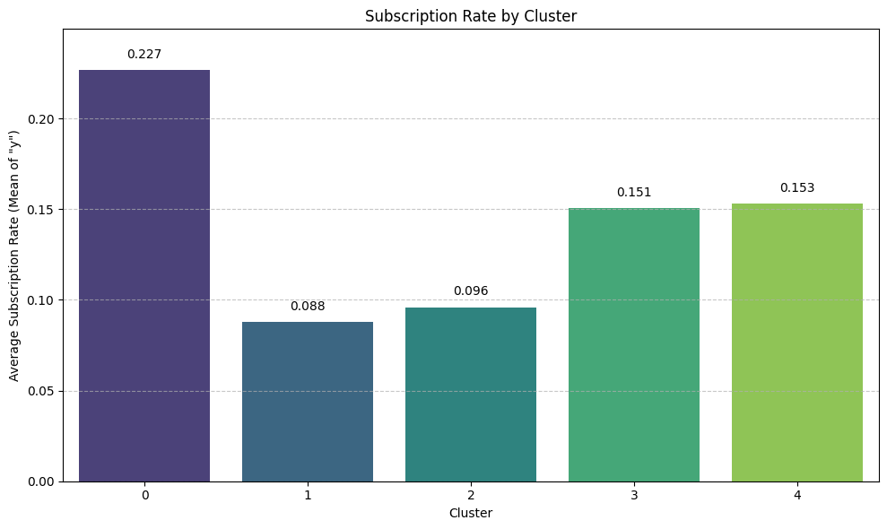

# Bank Telemarketing Analytics

A business analytics project exploring customer behaviour and term-deposit subscriptions to support bank marketing decisions.

## Business problem

Contacting customers takes time and resources. I explored how customer data could help a bank prioritise outreach and plan more targeted campaigns.

## Key questions

- Which customer groups have higher subscription rates?
- What customer traits are linked to subscriptions?
- Can prediction models help identify likely subscribers?
- How could these findings support campaign planning?

## My approach

### Customer segmentation

I used K-means clustering to group customers with similar traits, then compared their profiles and subscription rates.

### Subscription prediction

I compared Logistic Regression, Decision Tree, Random Forest, XGBoost, and LightGBM models.

I reviewed precision, recall, F1-score, and accuracy to understand how well each model identified subscribers and where it made mistakes.

### Explaining predictions

I used charts and SHAP analysis to explore what influenced the model's predictions and explain the results.

## Key findings

- **Subscription rates varied across customer groups.** Cluster 0 had the highest rate at 22.7%, compared with 8.8% in Cluster 1, the largest group.
- **Class weighting helped identify more subscribers.** On the test set, LightGBM's recall increased from around 21% to 61%, while precision fell from 64% to 32%. It identified more actual subscribers but also incorrectly flagged more non-subscribers.
- **The customer groups overlapped.** The five-cluster solution had a silhouette score of approximately 0.17. I treat these groups as broad profiles for exploration.

Cluster 0 had the highest subscription rate at 22.7%. Chart values are shown as proportions: 0.227 means 22.7%.

## Business recommendations

Based on the analysis, I recommend:

- Testing targeted outreach to the group with the highest historical subscription rate.
- Choosing a prediction threshold that fits the team's calling capacity and contact budget.
- Checking whether the customer profiles and model performance remain consistent in newer data.
- Comparing subscription rates and cost per subscription in a small campaign test before expanding it.

The findings come from historical data. A campaign test would be needed to measure actual business impact.

## Tools used

- **Python:** Data preparation, customer segmentation, and prediction.
- **pandas and NumPy:** Data handling.
- **scikit-learn, XGBoost, and LightGBM:** Modelling and evaluation.
- **Matplotlib and Seaborn:** Charts.
- **SHAP:** Model explanations.
- **Tableau:** Data exploration.

## Explore the project

### Notebooks

- [Customer segmentation](notebooks/01_customer_segmentation.ipynb)
- [Subscription prediction](notebooks/02_subscription_prediction.ipynb)

### Documentation

- [Data dictionary](docs/data_dictionary.md)
- [Customer segmentation findings](docs/segmentation.md)
- [Model evaluation](docs/model_evaluation.md)
- [Business recommendations](docs/business_impact.md)

### Presentation

- [Read the case study (PDF)](reports/bank_marketing_case_study.pdf)
- [Download the PowerPoint](reports/bank_marketing_case_study.pptx)

### Tableau Dashboard

I built an interactive Tableau dashboard to explore customer subscription patterns, customer clusters, job groups, and key campaign insights.

[View the Interactive Dashboard on Tableau Public](https://public.tableau.com/app/profile/aadesh.baral8088/viz/bank_marketing_dashboard_17913543953770/Dashboard1?publish=yes)

You can also download the Tableau workbook here:

[Download Tableau Workbook](tableau/bank_marketing_dashboard.twbx)

## Project status

The notebooks, documentation, charts, case-study presentation, and Tableau dashboard are available.

## Acknowledgement

AI tools helped with code development, debugging, and documentation. I reviewed, tested, and ran the code.
