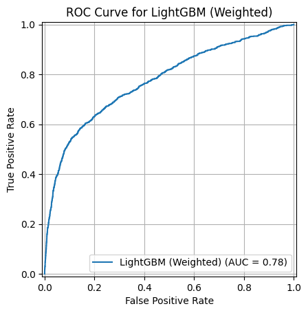
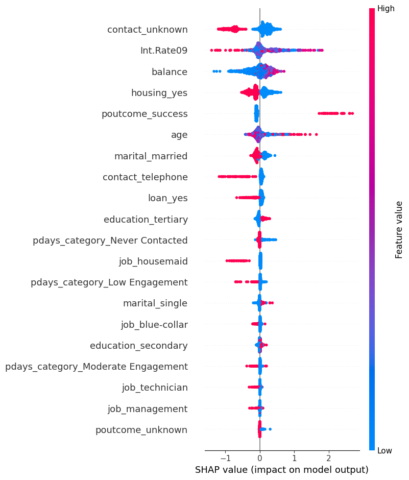

# Subscription Prediction: Model Evaluation

## Purpose

I compared prediction models to understand how they could help a bank identify customers likely to subscribe to a term deposit.

## How I tested the models

I split the data into 80% for training and 20% for testing, keeping a similar proportion of subscribers in both sets.

The test set contained 9,043 records, including 1,058 subscribers. I excluded call duration from the inputs because it would not be available before contacting a customer.

## Why I looked beyond accuracy

Only about 11.7% of customers subscribed. Predicting “no” for everyone would achieve around 88.3% accuracy but miss every subscriber.

I therefore compared accuracy with three other measures:

- **Precision:** How many customers predicted to subscribe actually subscribed.
- **Recall:** How many actual subscribers the model identified.
- **F1-score:** A measure that balances precision and recall.

## Model results

Precision, recall, and F1-score below refer to customers who subscribed. Figures are rounded.

| Model | Accuracy | Precision | Recall | F1-score |
| --- | ---: | ---: | ---: | ---: |
| Logistic Regression | 89.4% | 68% | 18% | 0.28 |
| Random Forest | 88.3% | 50% | 21% | 0.29 |
| Decision Tree | 82.4% | 28% | 32% | 0.30 |
| XGBoost | 89.0% | 57% | 23% | 0.33 |
| LightGBM | 89.4% | 64% | 21% | 0.31 |
| LightGBM with class weighting | 80.4% | 32% | 61% | 0.42 |

This table summarises my initial models and the weighted LightGBM model I explored further. The notebook also includes other weighted models.

## What class weighting changed

I gave subscribers more weight during LightGBM training to help the model identify more of this smaller group.

On the same test set:

| Result | Standard LightGBM | Weighted LightGBM |
| --- | ---: | ---: |
| Subscribers correctly identified | 220 | 641 |
| Subscribers missed | 838 | 417 |
| Non-subscribers incorrectly flagged | 124 | 1,355 |

Recall increased from around 21% to 61%, while precision fell from 64% to 32%.

The weighted model identified more actual subscribers, but it also made more incorrect positive predictions.

Its ROC-AUC score was 0.7752, showing how well it distinguished subscribers from non-subscribers across prediction thresholds.

## What this means for campaign planning

The results show a trade-off between reaching more potential subscribers and keeping the contact list focused.

With limited calling capacity, higher precision could help reduce contacts with customers unlikely to subscribe. If the aim is to identify more potential subscribers, higher recall may be useful, provided the team can handle the additional contacts.

I would compare prediction thresholds against the campaign budget and calling capacity before recommending a model for use.

## Recommended next steps

- Compare thresholds to find a suitable contact-list size.
- Include contact costs and the expected value of a subscription.
- Test the model on data from a later period.
- Run a small campaign test to compare model-based targeting with the usual approach.

These results measure prediction performance on historical data. Campaign impact would need to be measured through the proposed test.

## Model charts

### ROC curve

The weighted LightGBM model achieved a ROC-AUC score of 0.7752, shown as 0.78 in the chart.

### SHAP summary

I used SHAP to explore how different features influenced predictions. Points to the right push predictions towards a subscription; points to the left push them away.

## Notebook

[View my subscription prediction analysis](../notebooks/02_subscription_prediction.ipynb)
